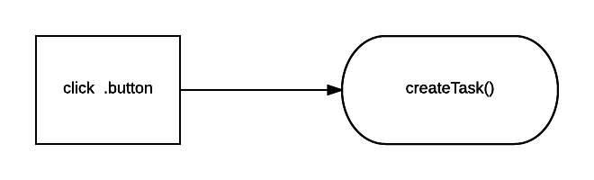

# Backbone Review

(add) INTENTION: think about bigger picture, not about just making a backbone app

Review what we have learned so far with Backbone by going over the essential components and

This repo includes a completed Backbone application version of Trek that we will refer to for the activities.

**Fork and clone this repository to follow along.**

***

## 1) Review Components
Below are the Backbone components we have focused on to build our single page applications. Each component has a brief explanation along with a link to it's documentation.

- [Model](#model)
- [Collection](#collection)
- [View](#view)
- [Events](#events)

### Model
Models are

The model will hold our applications business logic code.
[Backbone.model Documentation](http://backbonejs.org/#Model)

### Collection
Handles a group of related models.

[Backbone.collection Documentation](http://backbonejs.org/#Collection)

### View

**Notes on `el` `$el` and `this.$`:**
- **`el`:** A View's `el` property is it's DOM element. Every view has one and by default, unless otherwise defined, is a div element.
- **`$el`:** The jQuery wrapper around the View's `el` property. It gives you easy access to jQuery methods like `show()`, `hide()` and `addClass()`.
- **`this.$`:** The jQuery selector function, [_scoped_](http://api.jquery.com/jquery/#selector-context) to only search within the children of the View's DOM element. This allows you to make selector calls and be certain that you're not affecting any parts of the page outside of your View's responsibility.

You should always design your Backbone Views so that they never modify DOM elements that aren't children of `el`. The easiest way to make sure that your Views hold to that design is to **only ever use `this.$` and `$el` to modify the page**.

Using the standard jQuery `$` is acceptable if you need to _read_ parts of the page, such as to get the content for a template.

[Backbone.view Documentation](http://backbonejs.org/#View)

### Events
Defined inside of Backbone.views

[Backbone.events Documentation](http://backbonejs.org/#Events)

**Activity:** List all the components of Trek
List all of the components


***

## 2) How we have structured our Backbone applications
The point of backbone is to provide a very intentional structure to our front-end code, so that we know where to find the code that is handling the specific functionality of our application.

With Backbone being a less opinionated library/framework, it also has less rules and conventions on


### App.js


### Views
- **application_view** was the most arbitrary. Why is it there?
- **contact_view**
- **rolodex_view**


### Models

Right now our models have done very little. We have used them to set defaults.

Then can also...

We will utilize them a lot more with Tic-Tac-Toe, and that lesson will come on Monday.

### Collections


### That Other stuff
Because our Backbone application relies on a few other libraries to get it's gear'a'grinding, we have a json file that keeps track of those libraries and will include them into our project when we run `npm install`.

To add more libraries, or to see which ones are already included, open the `package.json` file and look under `"devDependencies": {}`

If this process sounds familiar, it's because it's basically the same as having a gem file in rails and running *'bundle install'*.

- **Webpack**

- **Underscore**

- **JQuery** Anytime you see that money sign, you're working with a Jquery object. That Jquery object is set by referring to a

***

## 3) Review How the Components Interact with Each Other
Each component is responsible for specific functionality of our application. These components rely on each other, which can quickly complicate how data flows through our application.

The below activities practice understanding how the components interact with each other.

- [Rendering Views](#rendering-views)
- [Tracing Events](#tracing-events)
- [Initial Page Load](#initial-page-load)

### Rendering Views

**The structure of our HTML has hierarchy** When an HTML element is nested inside of another element, the outer-most element has a higher hierarchy. That outer-element acts as a container for it's inner-elements.

Some backbone views will be responsible for other views and act as a container with hierarchy over the inner-elements that are generated from the views.

For example, in the Rolodex project, the Rolodex view was responsible for rendering many contact views


With our application, a single page will likely have many different Backbone views rendering as once.


**Activity:** Views Responsibility

With this activity, we will get more comfortable recognizing the code that is

Each of the following views should correspond to a color. ex: trip view is yellow, trip_lis view is blue and app view is red. Use that color to draw a square around all the code that corresponds to that view, including view files, html


- trip view
- trip_list view
- app view


### Initial Page Load
**Activity:**
Some of our JavaScript is run immediately when the page loads, and some of it doesn't run until the user does something. To help understand which is which and in what order various things happen, let's leave ourselves a trail of breadcrumbs to follow. We'll start by looking at what does and doesn't happen when the page is first loaded.

To do so, we'll add a log line to the top of every function in our TREK app. Each line should be of form

```javascript
console.log(">>> BREADCRUMBS: #");
```

Where `#` is the order in which the log line appears when the app is started. If the function shouldn't be called when the page is first loaded, replace `#` with `does not print`. So the first line to be printed out should look like

```javascript
console.log(">>> BREADCRUMBS: 1");
```

Did things appear in the order you expected? Did you get any `does not print`s? Check in with the person next to you and verify, then revise your numbering if needed.

Now change your numbering to reflect the order that functions are called when various buttons are pressed.


## Tracing Events

**Activity**
It can be difficult to figure out when functions get called when we're listening to events and there's not one line of execution to follow.  Now you and your partner will be diving into the events and the functions listening to those events in this Trek App.  

### DOM Events

Using a whiteboard make a list of the DOM events each of the views are listening to and draw arrows to functions that the events trigger.  

-  When button 'See All Trips' is clicked
-  When button 'Make Reservation' is clicked



Now look at the event handler functions, do they invoke other events or functions?  Diagram those as well.

### Backbone Events

Look at the listenTo calls in the initialize functions.  Are any of the views listening to events on other objects, such as Models, Collections or Views?

Diagram those events as well.

### Check your work

Now cause the events to trigger, for example click on a trip, or add a reservation.  

-  Look at the console log messages you put in earlier for the Page Load activity.
-  Did they print? Were they in the expected order?  Why or why not?
-  How many events did you identify?  Check with a neighbor to see if they have the same.  


## 4) Would this be a backbone app?


Soundcloud.com
HTML5zombo.com
